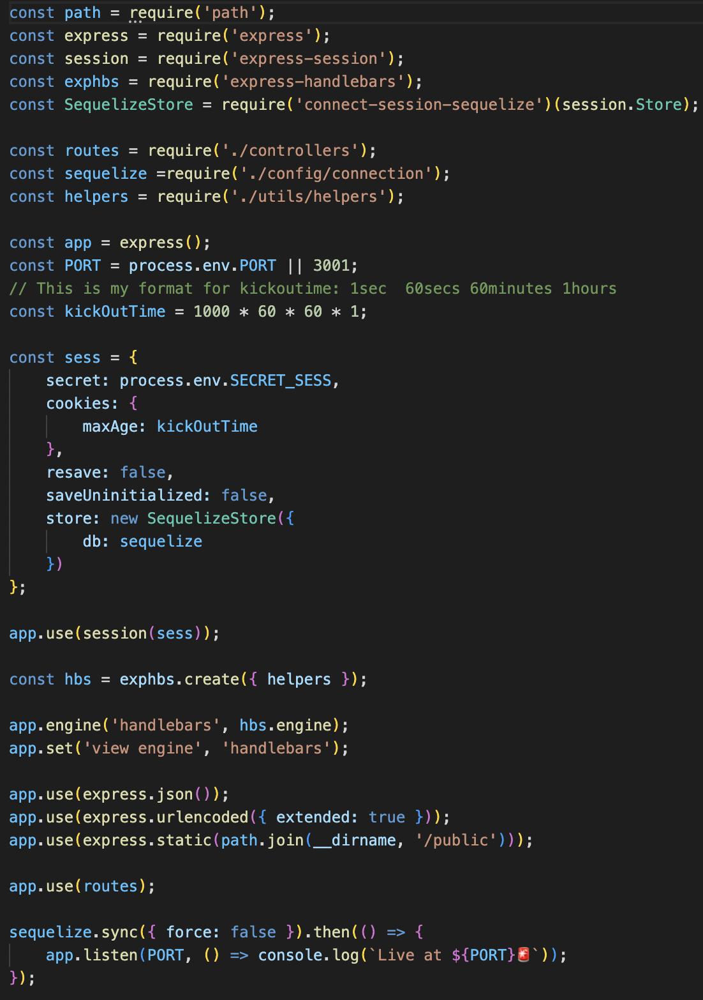
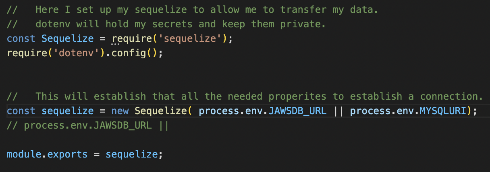
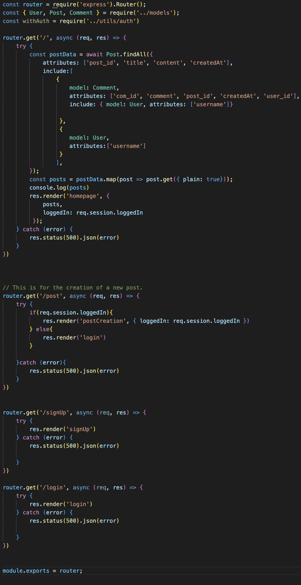
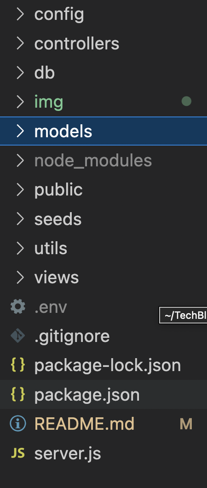

# TechBlogging 

  
webLink:
https://techbloggging.herokuapp.com/

gitHub:
https://github.com/JimmySolis/TechBlogging

  ## Description
  For this project I have made a website that allows the user to create an account. They are able to read posts of others in their homepage and leave a comment. Also, if they go to there dashboard they can make a post!  

  ## Table of Contents 
  - [Installation](#installation)
  - [Usage](#usage)

  ## Installation
  No need for installation. All that is needed is for you to visit the website and sign-up. If you are a member alreay then simply sign-in and post away.

  ## Usage
  Follow the link provided in the read me or look it up in your browser. After that try the same prossess as discussed in the Install part of the read me and you are set to go. 

  ## Questions
  Here is my email for questions:  jimmysolis14@gmail.com
   
  If you would like to look me up in github, here is my username: JimmySolis
   
  Follow these instructions to contact me:  
  Please email me. I will get back in a day.

  ## How it works:

  ### 1) I make sure I have a server that connects all my routes, api's, and db.

  

  ### 2) Then have a connection file that holds the variables to connect to the db.

   

  ### 3) Once online I have made routes that hit certain points to get the user what they need.

   

   ### 4) In the back end I also have models, public folder, and views folder that create the app. They hold handlebar and extentions of sequile modles that make it easy for me to create the models I used for the user, posts, and comments.

   